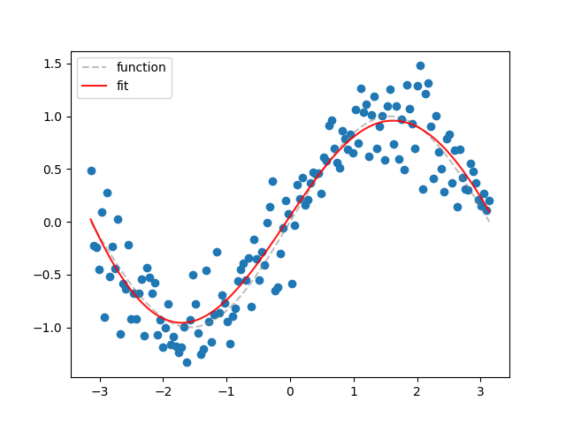
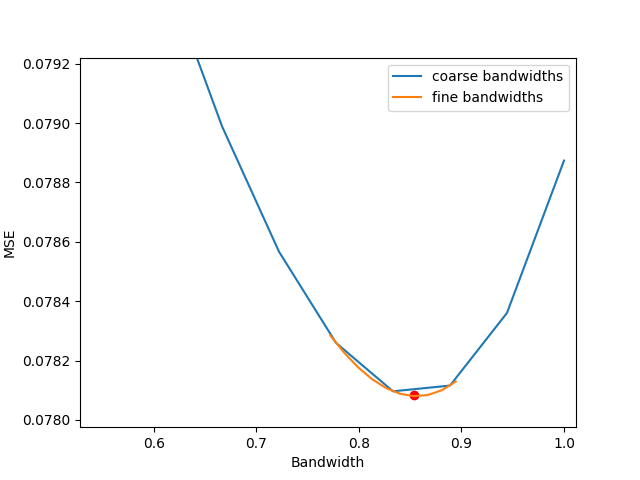

Examples
================================================================

Create Fit with ``LocalPolynomialRegression``
----------------------------------------------------------------

Use the method ``LocalPolynomialRegression.fit`` in order to create the fit for the dataset and estimate 
the first and second derivative for the fit::

    import numpy as np
    from matplotlib import pyplot as plt
    from localpoly.base import LocalPolynomialRegression

    np.random.seed(1)
    X = np.linspace(-np.pi, np.pi, num=150)
    y_real = np.sin(X)
    y = np.random.normal(0, 0.3, len(X)) + y_real

    model = LocalPolynomialRegression(X=X, y=y, h=0.8469, kernel="gaussian", gridsize=100)
    prediction_interval = (X.min(), X.max())
    results = model.fit(prediction_interval)

    plt.scatter(X, y)
    plt.plot(X, y_real, "grey", ls="--", alpha=0.5, label="function")
    plt.plot(results["X"], results["fit"], "r", alpha=0.9, label="fit")
    plt.legend()
    plt.show()

Bandwidth Optimization with ``LocalPolynomialRegressionCV``
----------------------------------------------------------------

Use the method ``LocalPolynomialRegressionCV.bandwidth_cv`` in order to optimize the bandwidth 
for the selected kernel::

    import numpy as np
    from matplotlib import pyplot as plt
    from localpoly.base import LocalPolynomialRegressionCV

    np.random.seed(1)
    X = np.linspace(-np.pi, np.pi, num=150)
    y_real = np.sin(X)
    y = np.random.normal(0, 0.3, len(X)) + y_real

    model_cv = LocalPolynomialRegressionCV(
        X=X,
        y=y,
        kernel="gaussian",
        n_sections=15,
        loss="MSE",
        sampling="random",
    )

    results = model_cv.bandwidth_cv(np.linspace(0.5, 1.0, 10))
    print(f"Optimal bandwidth: {results['fine results']['h']}")
    plt.plot(results["coarse results"]["bandwidths"], results["coarse results"]["MSE"])
    plt.plot(results["fine results"]["bandwidths"], results["fine results"]["MSE"])
    plt.show()

